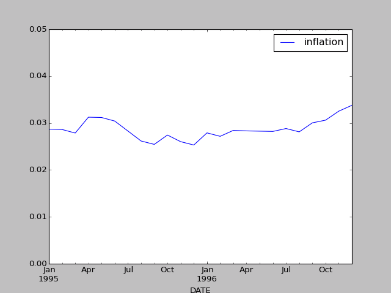

# TimeSeriesGif

Got a pandas time series dataframe? Want to create gifs out of it? Maybe you're trying to get a better sense of your time series through different slices of time? Cool.



# Installation

`pip install TimeSeriesGif` 

# Usage 

Import the package like such:

```
from TimeSeriesGif import TimeSeriesGif
``` 

Hopefully you are familiar with the way pandas creates plots. TimeSeriesGif is essentially a wrapper for the DataFrame `plot` [method](https://pandas.pydata.org/pandas-docs/stable/generated/pandas.DataFrame.plot.html). 

```
TimeSeriesGif.time_series_to_gif(pandas_df, out_file, window=24, step=3, 
					plot_type='line', use_index_as_title=False,
					gif_duration = 0.5, **kwargs):
```

* `pandas_df`: your pandas dataframe or series that you want to plot 
* `window`: the number of rows you want in each frame of the gif
* `step`: the number of rows you want to increment in each frame of the gif
* `plot_type`: passed as a keyword argument to pandas's "plot" function's "kind" argument. For example: `df.plot(kind='line')` or `.plot(kind='scatter')`. 
* `use_index_as_title`: use the last index value in the window as the title
* `gif_duration`: the length of time between frames
* `kwargs`: Other keyword arguments you may want to pass to the pandas "plot" method. 

# Example

You like macroeconomics? Trying to make some cool inflation gifs? 

Well go ahead and fire up your consumer prices there, buddy. 

```
import pandas_datareader.data as web
from TimeSeriesGif import TimeSeriesGif

df = web.DataReader("CPIAUCSL", "fred", start="1900-01-01", end="2017-07-07")
```

Transformations? No problem. Get some annual percent changes maybe.

```
df = df["CPIAUCSL"].pct_change(12).to_frame("inflation")
df = df[df.index >= "1995-01-01"]
```

Now all you gotta do is: 

```
TimeSeriesGif.time_series_to_gif(df, 'test.gif', 
		window=24, step=3, plot_type='line',  
		gif_duration=1,
		ylim=(0.005, 0.05))

```

The arguments mean that you are:

* Naming your file 'test.gif' because you aren't a creative person
* Taking a 24 month window
* Incrementing by 3 months at a time
* Making a line plot
* Creating a 1 second lag between each frame
* Bounding the y axis